  

# 📹 Awesome Video Calling & VoIP Ecosystem 📞

> 🚀 A curated list of top **SaaS platforms**, **Open-Source video calling software**, **WebRTC media servers**, and **SIP VoIP telephony** frameworks for real-time audio/video communication.

---

## 📋 Table of Contents
- [📊 Market Overview & Insights](#-market-overview--insights)
- [☁️ SaaS & Hosted Video Conferencing Platforms](#%EF%B8%8F-saas--hosted-video-conferencing-platforms)
- [🔓 Open-Source Video Calling & Telephony Repositories](#-open-source-video-calling--telephony-repositories)
  - [📹 Conferencing & Client Applications](#-conferencing--client-applications)
  - [🌐 WebRTC Media Servers & Infrastructure](#-webrtc-media-servers--infrastructure)
  - [⚡ Protocol Stacks & Signaling Engines](#-protocol-stacks--signaling-engines)
- [🏗️ Architecture & Key Technology Comparison](#%EF%B8%8F-architecture--key-technology-comparison)
- [🤝 How to Contribute](#-how-to-contribute)
- [💖 Support & Sponsorship](#-support--sponsorship)
- [🔒 Disclaimer & Security Considerations](#-disclaimer--security-considerations)
- [⭐ Star History](#-star-history)

---

## 📊 Market Overview & Insights

> **📈 Market Size & Structure**: The global video conferencing and VoIP market is estimated at **~$33.5 Billion in 2026** (projected to reach over $60B by 2030 at a CAGR of ~11.5%). The commercial SaaS market is **highly concentrated** (winner-take-most dynamics dominated by Microsoft Teams, Zoom, and Google Workspace), while the self-hosted, enterprise security, and developer infrastructure sector remains **moderately fragmented** across specialized WebRTC SFUs and open-source telephony servers.

---

## ☁️ SaaS & Hosted Video Conferencing Platforms

The table below lists leading commercial SaaS video calling and messaging platforms, ordered by **Market Valuation / Annual Revenue (Descending)**.

| Platform | Market Valuation / Annual Revenue | Starting Paid Tier Pricing | Free Tier Limits / Free Trial | Description & Key Features |
| :--- | :--- | :--- | :--- | :--- |
| **[Microsoft Teams](https://www.microsoft.com/microsoft-teams/)** | **~$3.1 Trillion** *(Microsoft Corp Parent Market Cap)* | **$4.00 / user / month** *(Teams Essentials)* | **60 min limit**, max 100 participants per call | Enterprise hub integrating meetings, chat, and Office 365. 🏢 |
| **[Google Meet](https://meet.google.com/)** | **~$2.0 Trillion** *(Alphabet Inc Parent Market Cap)* | **$6.00 / user / month** *(Workspace Business Starter)* | **60 min limit** for group calls (100 participants max) | Browser-native video conferencing integrated with Google Workspace. 🌐 |
| **[Apple FaceTime](https://support.apple.com/facetime)** | **~$3.4 Trillion** *(Apple Inc Parent Market Cap)* | **$0.00** *(Bundled with Apple hardware purchase)* | **100% Free** (Up to 32 participants, requires Apple ID) | Encrypted native video calling with shareplay on Apple devices. 📱 |
| **[WhatsApp](https://www.whatsapp.com/)** | **~$1.4 Trillion** *(Meta Platforms Parent Market Cap)* | **$0.00** *(Ad & Business API funded)* | **100% Free** (Group video calls up to 32 participants) | End-to-end encrypted voice and video calling used by 2B+ users. 💬 |
| **[Discord](https://discord.com/)** | **~$15.0 Billion** *(Private Valuation)* | **$2.99 / month** *(Nitro Basic)* | **100% Free** (Up to 25 video streams in voice channels) | High-performance voice and video rooms for gaming & communities. 🎮 |
| **[Zoom](https://zoom.us/)** | **~$21.5 Billion** *(NASDAQ: ZM Market Cap)* | **$13.33 / user / month** *(Pro Plan)* | **40 min limit** on group meetings (up to 100 users) | Dominant enterprise video conferencing platform with AI Companion. 🤖 |
| **[Telegram](https://telegram.org/)** | **~$30.0 Billion** *(Estimated Private Valuation)* | **$4.99 / month** *(Telegram Premium)* | **100% Free** (Unlimited 1-on-1 calls; group video up to 1000 viewers) | Cloud messaging with high-capacity group video calls & screen sharing. ✈️ |
| **[Signal](https://signal.org/)** | **Non-Profit / $50M+ Grant Funded** | **$0.00** *(100% Free / Open Donations)* | **100% Free** (End-to-end encrypted calls up to 40 participants) | Open-source privacy non-profit video calling with zero metadata tracking. 🔐 |
| **[Skype](https://www.skype.com/)** | **Subsidiary of Microsoft** | **$2.99 / month** *(Sub for landline/mobile calling)* | **100% Free** (Up to 100 participants, 4-hour call limit) | Pioneer VoIP & video calling service with international PSTN calling. ☎️ |

---

## 🔓 Open-Source Video Calling & Telephony Repositories

All repositories below feature a GitHub Social Star Badge linked directly to their **Stargazers page**, sorted by **GitHub Stars (Descending)**.

### 📹 Conferencing & Client Applications

- **[Jitsi Meet](https://github.com/jitsi/jitsi-meet)**   
  🎥 **The de facto open-source Zoom alternative.** WebRTC SFU platform (Apache-2.0). Features instant room links, screen sharing, etherpad integration, end-to-end encryption, and simple Docker deployment.

- **[LiveKit](https://github.com/livekit/livekit)**   
  ⚡ **Cloud-native WebRTC stack and RTC engine in Go.** Powers multi-tenant conferencing applications, real-time AI agents, and voice bots with distributed horizontal scaling.

- **[Element Web (Matrix Client)](https://github.com/element-hq/element-web)**   
  💬 **Glossy Matrix collaboration app.** Supports decentralized, end-to-end encrypted video conferencing, voice chats, and federated communications.

- **[Matrix Synapse](https://github.com/element-hq/synapse)**   
  🌐 **Reference Matrix homeserver.** Enables decentralized real-time communication routing and VoIP signaling over open federation protocols.

- **[BigBlueButton](https://github.com/bigbluebutton/bigbluebutton)**   
  🎓 **The gold standard virtual classroom platform.** Features multi-user whiteboard, breakout rooms, polling, LMS integration (Moodle/Canvas), and mediasoup SFU audio/video backend.

- **[MiroTalk P2P](https://github.com/miroslavpejic85/mirotalk)**   
  💻 **Browser-based WebRTC real-time video calls.** Lightweight peer-to-peer audio/video conferencing system up to 4K/60fps with screen sharing and chat.

- **[La Suite Meet](https://github.com/suitenumerique/meet)**   
  🏛️ **Modern sovereign European video conferencing.** Powered by LiveKit, Django, and React. Built for public sector deployment with clean UX.

- **[Nextcloud Talk](https://github.com/nextcloud/spreed)**   
  ☁️ **Self-hosted video calling integrated into Nextcloud.** Provides private chat, video calls, and screen sharing with optional Janus SFU backend.

- **[eduMEET](https://github.com/edumeet/edumeet)**   
  🏫 **Federated video conferencing for research and education.** Created under the GÉANT framework for academic network deployment.

- **[Jami](https://git.jami.net/savoirfairelinux/jami-project)**   
  🔒 **Peer-to-peer serverless video calling app.** Uses Distributed Hash Tables (DHT) with zero server infrastructure for maximum privacy.

- **[plugNmeet](https://github.com/mynaparrot/plugNmeet-server)**   
  🔌 **High-performance scalable web conferencing system.** Built with Go and LiveKit for embedding interactive meetings into custom web platforms.

- **[Linphone Desktop](https://github.com/BelledonneCommunications/linphone-desktop)**   
  📞 **Leading open-source SIP client and softphone.** Supports HD audio/video calls, enterprise IPBX integrations, and TLS/SRTP encryption.

- **[Galene](https://github.com/jech/galene)**   
  🚀 **Ultra-lightweight WebRTC videoconferencing server.** Written in Go with minimal resource footprint, designed for lectures and small groups.

---

### 🌐 WebRTC Media Servers & Infrastructure

- **[Pion WebRTC](https://github.com/pion/webrtc)**   
  🐹 **Pure Go implementation of WebRTC.** Extremely popular for building custom SFUs, voice bots, and WebRTC data channel processing tools.

- **[Coturn TURN/STUN Server](https://github.com/coturn/coturn)**   
  🛰️ **Essential VoIP NAT traversal server.** Free open-source implementation of TURN and STUN server specs required for WebRTC connection establishment.

- **[Janus WebRTC Gateway](https://github.com/meetecho/janus-gateway)**   
  🚪 **General-purpose, C-based WebRTC server.** Uses plugin architecture supporting VideoRoom SFU, SIP gateway, streaming, and audio bridges.

- **[mediasoup](https://github.com/versatica/mediasoup)**   
  🥣 **Cutting-edge Node.js/C++ SFU library.** Power-efficient stream forwarding designed to be embedded directly into custom Node.js backend services.

- **[Jitsi Videobridge](https://github.com/jitsi/jitsi-videobridge)**   
  🌉 **Java-based Selective Forwarding Unit (SFU).** High-capacity media relay engine powering Jitsi Meet conferences.

---

## 🏗️ Architecture & Key Technology Comparison

When choosing or designing a video calling architecture:

1. 🕸️ **Mesh (P2P)**: Direct media streams between participants. Best for 2–4 users. Zero server media costs, but upload bandwidth scales linearly with participant count ($O(N)$). *Examples: Jami, MiroTalk P2P*.
2. 🔀 **SFU (Selective Forwarding Unit)**: Server receives streams and selectively routes them to participants without transcoding. Highly scalable for 10–1000+ users. *Examples: LiveKit, Jitsi Videobridge, mediasoup, Janus*.
3. 🎛️ **MCU (Multipoint Control Unit)**: Server decodes, composites, and re-encodes streams into a single video frame. Heavy CPU consumption, useful for legacy telephony endpoints.

---

## 🤝 How to Contribute

1. 🍴 Fork the repository.
2. 📝 Add or update entries in `README.md` maintaining SEO formatting and tabular standards.
3. ⭐ Ensure GitHub stars links and factual details (pricing, free tiers, licenses) are accurate.
4. 🔀 Open a Pull Request with a clear description of changes.

---

## 💖 Support & Sponsorship

Thank you for exploring the **Awesome Video Calling & VoIP Ecosystem** list! 🌟 If you find this repository helpful for your projects, research, or architecture design, please consider supporting the maintenance and growth of open-source resources:

- ⭐ **Star this repository** to help others discover it!
- 🍴 **Fork it** to contribute new tools and stay updated.
- 📣 **Share it** with fellow developers, engineers, and privacy advocates.
- ☕ **Buy me a coffee / Sponsor**: If you'd like to support my open-source work directly, check out my [GitHub Sponsor Dashboard](https://github.com/sponsors/ishandutta2007). Your support is greatly appreciated! 🙏

---

## 🔒 Disclaimer & Security Considerations

- 🛡️ Self-hosted WebRTC setups **must deploy a STUN/TURN server** (e.g., Coturn) to guarantee connection traversal across restrictive firewalls and symmetric NATs.
- ⚡ Bandwidth usage in SFU topologies scales quadratically for downstream data; ensure proper server network pipe provisioning.

---

## ⭐ Star History

---

  <b>Maintained with ❤️ by the open-source real-time communication community.</b>

